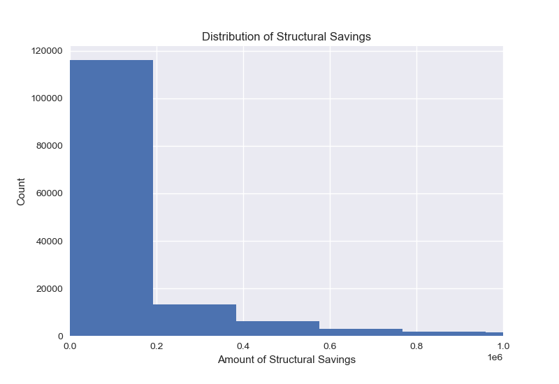
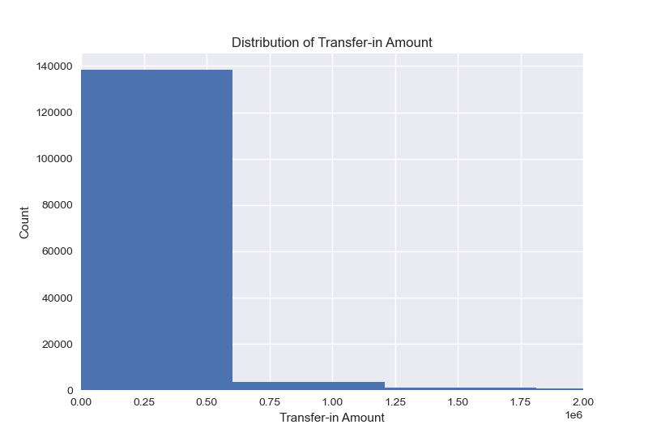
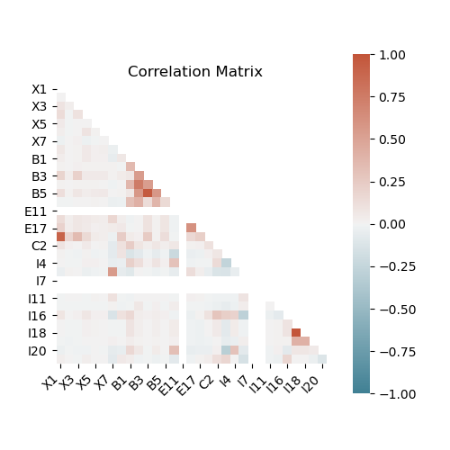
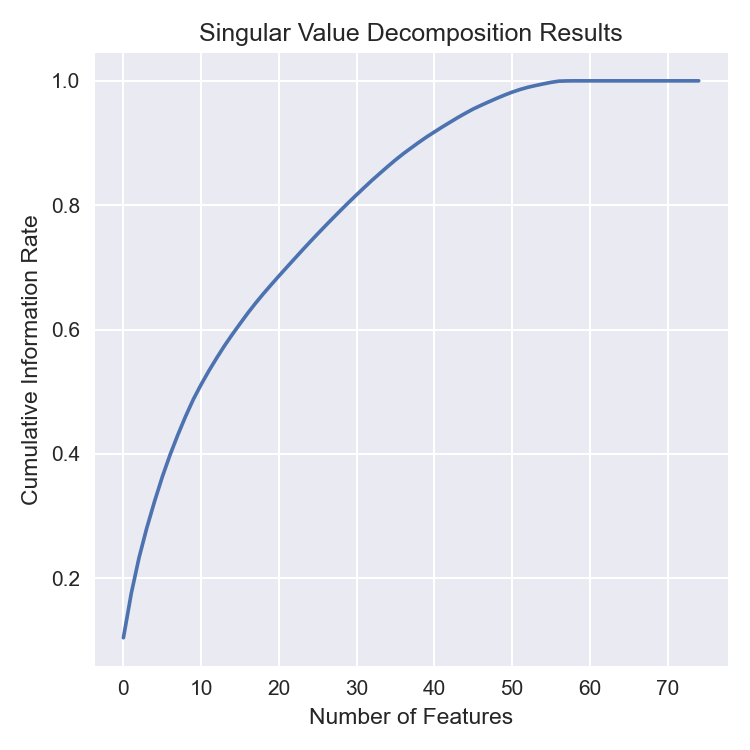
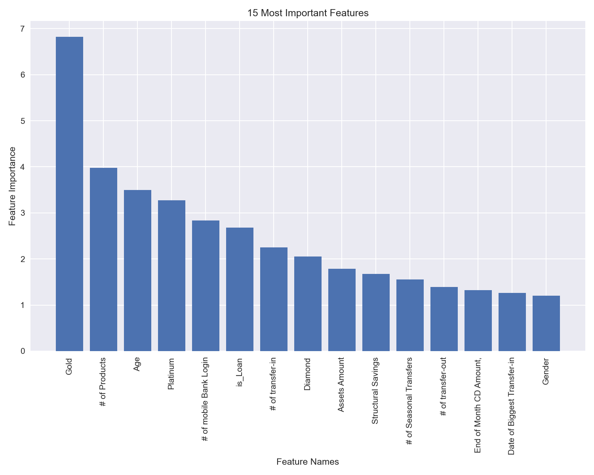
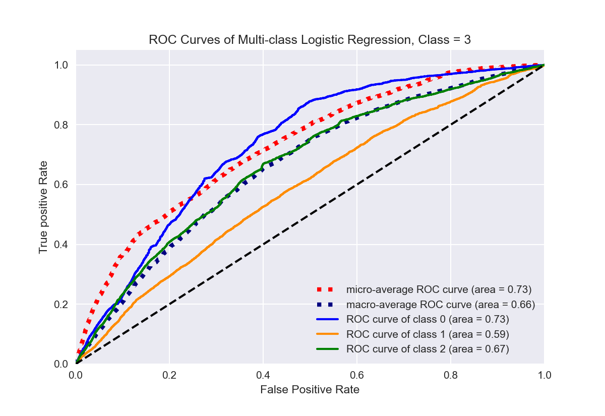
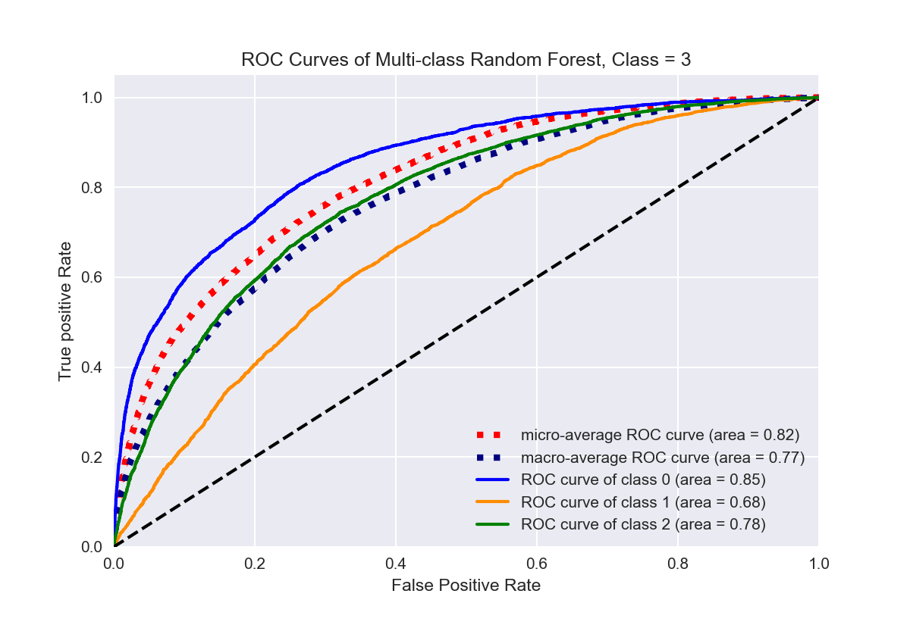

# Predicting Commercial Bank Retention (Churn) Rate using Supervised Machine Learning

## Description

This project applies supervised machine learning techniques to develop a prediction model that proactively predicts whether or not clients of a commercial bank will stay with the bank. The data come from real transaction records of [Xiamen International Bank](https://www.xib.com.cn/english/), a major commercial bank in China. 

The project starts with an Exploratory Data Analysis (EDA), followed by model development and implementation. The project then estimates the client's retention rate using the model. Finally, the project provides a business solution regarding how to precisely and efficiently target clients who are likely to churn.

### What is Churn?

Churn is defined as customers stop using a company's service and, in most cases, no longer paying for service fees. (Reference: [Churn Case Study](https://github.com/briandalessandro/DataScienceCourse/blob/master/ipython/python27/CaseStudy_Churn_Analysis.ipynb))

*A complete final report is available [here](https://github.com/tong-jin-nyu/churn-prediction-using-supervised-learning/blob/main/2401_Final_Deliverable_Tong_Jin.pdf).*

## Introduction

If you have a bank account, you probably know that banks offer opening bonuses in the form of cashback or reward points in order to encourage potential clients. A typical opening bonus works in the way that if a client agrees to put a certain amount of assets in the bank, he/she will receive direct discounts or promotions to other services from the bank. If you are an experienced bank client, you may have been contacted by banks about retention offers. Banks give various financial offers to clients to prevent them from leaving. There are two main reasons why banks are so obsessed with offers. First, banks need to maintain a healthy client relationship in order to keep a consistent revenue increase. Second, the finance industry is highly competitive. Banks constantly launch new marketing programs to discourage clients from going to competitors. After decades of improvement, nowadays, most commercial banks have adopted a retention-based client relationship model.

This project has two affiliations: 

1. It is the final project of the [Statistical Consulting Research Seminar](https://steinhardt.nyu.edu/degree/ms-applied-statistics-social-science-research/courses) course at New York University.

2. It is the team project of an active competition on Data Castle: [2020 Financial Modeling Competition](https://www.dcjingsai.com/v2/cmptDetail.html?id=439) by [Xiamen International Bank](https://www.xib.com.cn/english/). 

### Team Member

- [Tong Jin](https://github.com/tong-jin-nyu)
- [Zixuan Zhou](https://github.com/timzhou1009)
- [Zheng Tan](https://github.com/ZhengAndyTan)

## Research Design

The strategy is to train different supervised models using the train set and fit the model to the test set to measure the performance of model prediction.

### Research Questions

This project focuses on determining the most important features of a churn prediction model. The research questions are: 

- What are the most important features of the data? Are there any interesting findings regarding the data?
- Which algorithm has the best performance in predicting churns? How to estimate the performance?
- How to apply model results to solve real-world churn problems?

### Multi-class Models

- Logistic Regression (Baseline)
- Random Forest
- Gradient Boosting Machine

For each model, we applied grid search and randomized search to fine tune the hyperparameters. We also applied 5-fold cross validation to increase model accuracy.

### Measurements

The evaluation metrics used include: 

1. Receiver Operating Characteristic (ROC)

2. Area Under the ROC Curve (AUC)

The ROC curve visualizes the ratio between true positive rate (TPR) and false positive rate (FPR). The AUC measures model performance.

## Data

The data contain daily transaction records of Xiamen International Bank: 

- The train set contains all features
- The test set contains the same features as the train set
- The validation set contains a multi-class label with three possible values:
  - `1`: not churn
  - `0`: no preference
  - `-1`: churn

The train set and the validation set were randomly sampled from transaction records of the third and fourth quarters of 2019. The test set was randomly sampled from the first quarter of 2020.

For a complete list of feature descriptions, please visit our [wiki page](https://github.com/tong-jin-nyu/predicting-bank-customer-churn/wiki/Codebook).

*A complete final report is available [here](https://github.com/tong-jin-nyu/churn-prediction-using-supervised-learning/blob/main/2401_Final_Deliverable_Tong_Jin.pdf).*

## Results

### Descriptive

The processed training set contains 145,296 rows and 77 features. For clients’ assets, the average structured deposit balance is 21,001.53 (in RMB). The average amount of savings is 1,564.47. The average checking balance is 3,845.89. The distribution of these features is highly right-skewed, given the fact that there are people who possess a large amount of assets.

For the transaction data, on average, clients made 3 transfers per month. The average transfer-in amount is 23,729. Similar to the saving distribution, the distribution of transfer is also highly right skewed.

The average of monthly assets is 337,523.7. The distribution is also highly right-skewed.

For client’s personal information, out of 145,926 observations, 78,912 are female. 66,320 are male. The average age is 49, with a standard deviation of 15.95. 71,525 are normal clients. 54,142 of them are gold. 17,996 are platinum. 1,633 are diamonds (top-tier). 6,422 (4.42%) are marked as employees. 27,150 of them work in the business industry. Only 4.86% of them hold a bachelor (or above) degree.

### Correlations

Results indicate that the transfer-in amount is highly correlated with the transfer-out amount. This makes sense because clients are likely to transfer a similar amount of money for a certain period of time. 

### Feature Importance

From the SVD, we selected the top 37 features to keep 80% of the information from the full data. 

Figure 1. SVD Results

Here is the top 15 most important features in the data using Truncated SVD. 

Results indicate that client loyalty level is one of the most important features in predicting churns. Clients in “gold”, “platinum” or “diamond” are easier to be tagged, as compared to normal clients. The number of products associated with the bank is another important feature. Additionally, transfer frequency is a major category in prediction. Furthermore, age and gender are two personal information categories that contain important prediction information.

### Modeling

#### Logistic Regression

The micro-average score is 0.73. 

#### Random Forest

The micro-average score is 0.84.

#### Gradient Boosting Machine

The micro-average score is 0.82.

Here is a summary table of all model performances. The random forest model out-performed the rest two in all categories.

| Models | Micro-Avg | Macro-Avg | Class 0 | Class 1 | Class 2 |
|--------|-----------|-----------|---------|-------- |---------|
| Log Reg| 0.73      | 0.66      | 0.73    | 0.59    | 0.67    |
| RF     | **0.84**  | **0.81**  | **0.86**| **0.74**| **0.84**|
| GBM    | 0.82      | 0.77      | 0.85    | 0.68    | 0.78    |

## Conclusion

The result of this project proves that modern machine learning algorithms can reach a high prediction accuracy. To conclude, in this project, we explored all the features in the data and selected the top 15 most important ones. Among them, client loyalty and transfer frequency are two of the crucial features. After applying machine learning models, we managed to achieve a high accuracy using the random forest algorithm. 

Since this study is still at the alpha stage, it contains many potentials. For example, by expanding the data samples, we can reduce model variance and get stable results over time. We can also fine tune the hyperparameters of machine learning algorithms in order to prevent overfitting. Moreover, we can conduct more detailed data mining and EDA so that the data can be processed more precisely. This will reduce model bias and, consequently, increase the accuracy. 
